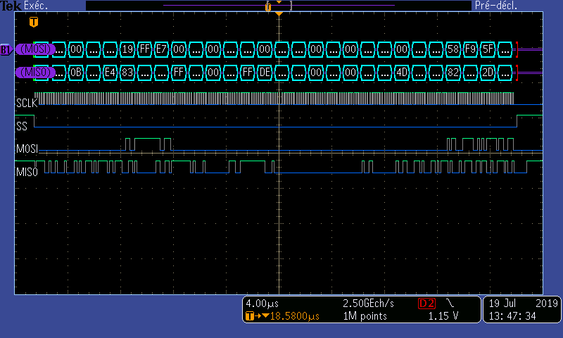
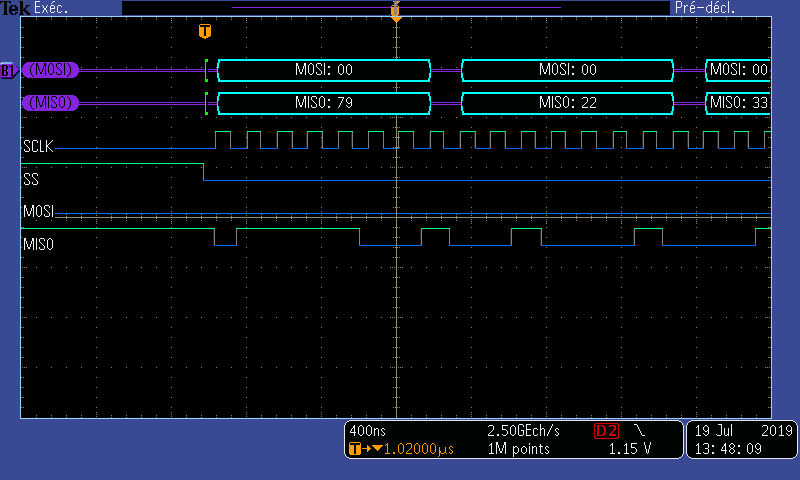

# BLMC µDriver SPI interface

Electrical connection
---------------------
The new µDriver v2 includes a SPI port. Controlling the µDriver via this interface allow fast communication compared to CAN, and facilitate the control of multiple µDriver from one master controller such as the Quadruped master board.
µDriver is acting as a SPI Slave device.

DF13 Pin | Pin Name | I/O | Function 
--- | --- | --- | --- 
1 | GND | - | Ground reference	
2 | MISO | Output | Data - Master In Slave Out	
3 | CLK | Input | Clock
4 | CS | Input | Chip Select, active low 	
5 | MOSI | Input | Data - Master Out Slave In

Connection link between a master controller and the µDriver should be kept short (20cm). The  µDriver inputs are not 5v Tolerant. Make sure not to apply more than 3.3V.

Timing
------
To be as efficient as possible, every transaction between the master and the µDriver is happening in one SPI transaction, with the bidirectional transmission of a 272bits packet.

This protocol has the particularity that all the µDriver state is defined in each transaction. This design have been motivated to allow non robust communication such as wireless link. Indeed if a packet is lost, all the state of the µDriver will be found in the next received packet.

**The whole communication is taking less than 35µs at 8Mhz**

1. Master is selecting a slave by lowering CS line
2. Master is generating the CLK signal at 8Mhz, Master is shifting out the Input message (control and commands), and simultaneously reading in the output message (sensor and state).
3. Master put the CS line high.
4. Next transaction can happen **after a minimum of 0.7ms** for the preparation of the next sensor packet.

Note that the clock parity is SPI **Mode 1** (clock idle low and data valid at rising edges).

Protocol
--------
All the data exchanged with the µDriver is stored in two packets that are exchanged simultaneously. The µDriver uses SPI-mode 1 (CPOL=0 CPHA=1).

## Command message (MOSI line)
A command message is the message transmitted from the Master to the µDriver.

Mode | Ref Positions | Ref Velocities | Ref Iq | Kp | Kd | I_sat | Index | CRC
--- | --- | --- | --- | --- | --- | --- | --- | ---
16bits | 2\*32bits | 2\*16bits | 2\*16bits | 2\*16bits | 2\*16bits | 2\*8bits | 16bits | 32bits

### Mode:
Mode register is used to set the mode of operation of the board. (Enable the motor, launch the calibration etc..)

15 | 14 | 13 | 12 | 11 | 10 | 9 | 8 | 7 | 6 | 5 | 4 | 3 | 2 | 1 | 0 |
--- | --- | --- | --- | --- | --- | --- | --- | --- | --- | --- | --- | --- | --- | --- | ---
ES | EM1 | EM2 | EPRE | EI1OC | EI2OC | - | - | Timeout | Timeout | Timeout | Timeout | Timeout | Timeout | Timeout | Timeout 

| | | |
|---|---|---|
ES<15> (Enable System) | 0: Disable the system, motor can not be controlled 1: Enable the system| When the system is disabled, no current is sent to the motor. This can be useful to trigger a safety stop. |
EM1 <14> (Enable Motor 1) | 0: Disable Motor 1 1: Enable Motor 1 | Enabling Motor will trigger the calibration procedure, aligning the rotor to a known magnetic field orientation. Minimal load should be applied while calibrating the motor. |
EM2 <13> (Enable Motor 2) | 0: Disable Motor 2 1: Enable Motor 2 | Enabling Motor will trigger the calibration procedure, aligning the rotor to a known magnetic field orientation. Minimal load should be applied while calibrating the motor. |
EPRE <12> (Enable Position Rollover Error for both motors) | 0: Disable the Rollover Error 1: Enable the Rollover Error | Rollover can happen if position is coded with a maximum range from -128 to 128 (approximately, see Data representation below). Enable the Rollover error will generate an error reported in the Status Field and will disable the system. |
EI1OC <11> (Enable Index 1 Offset Compensation) | 0: Disable Index Offset Compensation  1: Enable Index Offset Compensation | Incremental encoders often include an index line that can help to deduce the absolute position of the rotor shaft modulo one turn. If EIxOC is set to one, and if IDXxD has been reported in the Status word, Position will be offset to be zero at the first index detected. /!\ WARNING: Setting this bit will cause the position to jump. User need to take extra care if closed loop controller uses the position as feedback. | 
EI2OC <10> (Enable Index 2 Offset Compensation) | 0: Disable Index Offset Compensation  1: Enable Index Offset Compensation | Incremental encoders often include an index line that can help to deduce the absolute position of the rotor shaft modulo one turn. If EIxOC is set to one, and if IDXxD has been reported in the Status word, Position will be offset to be zero at the first index detected. /!\ WARNING: Setting this bit will cause the position to jump. User need to take extra care if closed loop controller uses the position as feedback. | 
Timeout <7:0> | 0-255: Timeout in ms | This value define a timeout to disable the system when no valid command have been received. The timeout value in express in ms, 0 correspond to an infinite timeout
\- <11:8> | Not used | Setting this bits has no effect. 

### CRC:
The integrity of the messages is checked with a CRC32 according to (https://github.com/gcc-mirror/gcc/blob/master/libiberty/crc32.c)
If a valid CRC is not transmitted, the command will be ignored.

## Sensor message (MISO line)
A sensor message is a message transmitted from the µDriver to the Master.

Status | Time Stamp | Positions | Velocities | Iq | Coils Resistances | ADC | last cmd Index | /CRC
--- | --- | --- | --- | --- | --- | --- | --- | ---
16bits | 16bits | 2\*32bits | 2\*16bits | 2\*16bits | 2\*16bits | 2\*16bits | 16bits | 32bits

> **Important note:** Compared to the behavior of the CAN interface the data are sampled at a rate imposed by the master. In the current implementation, the data sensor message is updated internally at a rate of about 1.5kHz.

>The data read can then be outdated up to 0.66ms. Doing finite differences on position data can lead to sampling artifacts.  Later implementation could include a Timestamp field if needed.

### Status:
A status register is used to get the state of the motor board, the status of calibration, the error codes etc...

 15 | 14 | 13 | 12 | 11 | 10 | 9 | 8 | 7 | 6 | 5 | 4 | 3 | 2 | 1 | 0 
--- | --- | --- | --- | --- | --- | --- | --- | --- | --- | --- | --- | --- | --- | --- | --- 
 SE | M1E | M1R | M2E | M2R | IDX1D | IDX2D | IDX1T |IDX2T | - | - | -  | Error code | Error code | Error code | Error code 

| | | |
|---|---|---|
| SE <15> (System Enabled ) | 0: System is disabled 1: System is enabled | |
| M1E <14> (Motor 1 Enabled) | 0: Motor 1 is disabled 1: Motor 1 is enabled | Motor might be disabled due to user command, or due to an error. |
| M1R <13> (Motor 1 Ready) | 0: Motor 1 is not ready 1: Motor 1 is ready | |
| M2E <12> (Motor 2 Enable) | 0: Motor 2 is disabled 1: Motor 2 is enabled | Motor might not be ready due to calibration running.|
| M2R <11> (Motor 2 Ready) | 0: Motor 2 is not ready 1: Motor 2 is ready | |
| IDX1D <10> (Index 1 Detected) | 0: No encoder index has been detected yet 1: At least one encoder index has been detected | This bit is important to check before setting EIOC in the Mode word. |
| IDX2D <9> (Index 2 Detected)|  0: No encoder index has been detected yet 1: At least one encoder index has been detected | This bit is important to check before setting EIOC in the Mode word. |
| IDX1T <8> (Index 1 Toggle) | Flips each time an encoder index has been detected | |
| IDX2T <7> (Index 2 Toggle) | Flips each time an encoder index has been detected | |
| - <6:4> | Not used | Reading this bits has no meaning.
| ErrorCode <3:0> | See CAN error code | Error code are now inherited from BLMC CAN Interface

### /CRC:

The integrity of the messages is checked with a CRC32 according to (https://github.com/gcc-mirror/gcc/blob/master/libiberty/crc32.c) witch output need to be complemented (XOR with 0xFFFF)
CRC value must be checked before interpreting any of the sensor message data.

## Data representation
To save bandwidth, Sensor and Commands are represented with a more compact representation compared to the CAN interface.

The following data representation is valid for both **Command** and **Sensor** messages (ex: Position and Ref Position share the same format)

Data | | Unit | Min | Max | Resolution (LSB) | Comment
|---|---|---|---|---|---|---|
Position | 32bits | turn | -128 | 127,999999940395 | 2^(-24) | Rollout can happen on position
Velocity | 16bits | k rpm | -16 | 15,9995117188 | 2^(-11) | |
Iq | 16bits | A | -32 | 31,9990234375 | 2^(-10) | This can be use as a feed-forward term for PD controller as well as current control
I_sat | 8 bits | A | 0 | 31,875 | 2^(-3) | Current saturation. Value of zero disables saturation check. Value of bigger than zero applies current saturation after the PD+ controller.
Coil resistance | 16bits | Ohm | 0 | 1,9999694824 | 2^(-15) | Useful to estimated coil temperature from U/I (Not implemented yet)
ADC | 16bits | V | 0 | 3.99993896484 | 2^(-14) | |
Kp | 16bits | A/rot | 0 | 31.99951171875 | 2^(-11) | Setting Kp=Kd=0 allow to do direct current control |
Kd | 16bits | A/k rpm | 0 | 63.9990234375 | 2^(-10) | Setting Kp=Kd=0 allow to do direct current control |
