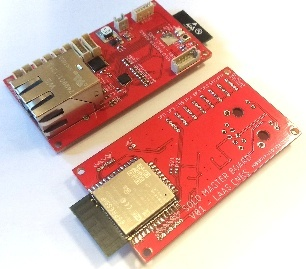
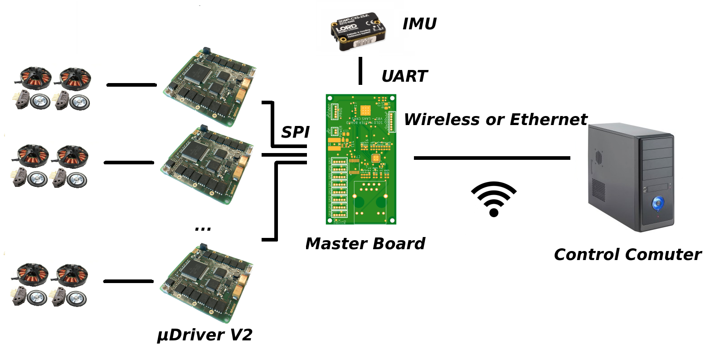

# Quadruped master board

This page collects the main specifications of a central control board for the quadruped robot.

The goal of such a board is to provide central access to all the robot's electronic components and connect to a control computer.

The board should:
* Provide a wired/wireless connection to close the control loop via an external computer.
* Ensure communication with all BLMC control cards (6 cards for a 12DoF robot) via SPI
* Interface with other sensors such as:
    * Inertial Measurement Unit
    * Battery status sensor
* Provide computing power to implement simple algorithms such as:
    * 3d admittance controller for each leg
    * Safety checks and emergency shutdown procedures
* Be easy to program for the robot to evolve.

Current design
--------------
The current Master board use an ESP32 SoC. (https://www.espressif.com/en/products/hardware/esp32/overview)

Design files and software of the master board can be found here: https://github.com/open-dynamic-robot-initiative/master-board

**Connectivity:**
* SPI: Address up to 8 SPI Slaves (max 80Mhz, DMA capable) compatible with BLMC µDriver SPI interface
* Wifi: Wireless communication with a computer via raw ESP-NOW: round trip time of 1.2ms (including driver and OS latency) for a 127bytes message.
* Ethernet: Wired communication with a computer via raw frames: round trip time of 0.2ms (including driver and OS latency) for a 127bytes message.
* GPIO: 4GPIO free. Can be mapped to I2C, UART etc..
* UART: Used to upgrade the ESP32 firmware, free on normal operation.

The board is programed via the ESP-IDF tool chain https://github.com/espressif/esp-idf

**Power supply:**

DC from 5V to 60V

Status
------
06/04/19:

A simplified version of the board is validated using dev boards and modules

* SPI communication with a modified µDriver V1 - working with DMA at 8Mhz. Can not go higher due to latency on MISO lines (limitation of the µDriver CPU). Need to validate the capacity of the µDriver to handle long transfer (currently limited to the FIFO size of 4x16bits)
* Ethernet validated with row packet communication
* Wireless validated with custom wifi driver

The PCB design is under review.

06/14/19: 10 PCB ordered

07/16/19: PCB received, two bards are assembled at LAAS and about to be tested

07/19/19: Ethernet on the assembled board is working. Demux is upside-down, creating a short-circuit, need to be re-solder. Need to change the silkscreen for the next revision.

07/24/19: Master Board's SPI, WiFi and Ethernet are working properly. The ESP32 is draining high peak current during RF auto-calibration (happening at boot from time to time). The DC/DC converter sometimes triggers an over-current protection causing the board to reset. Adding a 100µF capacitor between 3.3V and GND seems to fix this issue. A better power supply circuit and filter should be included in the next revision of the board.

08/01/19: First tests are conducted at MPI with the first prototype of master board. Loop is closed at 1kHz over WiFi. The control computer is computing a PD on 5 motors to follow a 6th motor position. SPI is only 99.2% relayable due to a µDriver limitation. Etienne Arlaud and Thomas Flayols will try to adress this issue.

3 to 4% of the sensors packet where lost durring wireless transmission. Command packets showed anormal loss of packet (>10%) Etienne Arlaud is working on this issue.

Ethernet communication seems to work reliably without any loss of packets.

Wireless closed loop control at 1kHz demo (click to see video):

Wireless constrains
-------------------
Wireless closed-loop systems are particularly challenging due to the degradation of controller performance caused by communication latency.

### Details on the evaluated RF solution

##### ESP-NOW protocol 
This solution uses non-connected raw WiFi frame (At MAC layer, without TCP/IP). Note that the latency with this solution is way lower than UDP on regular WiFi. benchmark here https://hackaday.io/project/161896-linux-espnow/log/162377-more-testing-with-rt-preempt

The main advantage is the possibility to use a standard WiFi interface on the computer side with fast communication capability with the OS. (Thomas Flayols and Etienne Arlaud are working on a dedicated driver for Linux https://hackaday.io/project/161896-linux-espnow)

The main drawback is the possibility of interference with surrounding networks. In a lab context, we could dedicate a 2.4GHz WiFi channel to the robot only. Note that performances could be affected by laptop and phones during big events.

##### Others

DWM1000, Xbee, Bluetooth, nrf24L01+ has been excluded.

