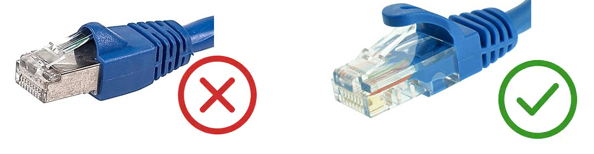

# Master Board Communication

The master board can be connected to a real time control computer via a direct Ethernet link, or via a special wifi interface.

Ethernet
--------
Ethernet connection with the robot is happening at the lowest level possible (MAC level without TCP/IP). You cannot use any switch or hub, but only a direct cable between the robot and a dedicated network interface. The model has been tested with a RT Preempt patched OS.

Prefer Ethernet cable without grounding to avoid to inject grid noise in the robot. (Plastic RJ45 connector)

### Lighten the cable!

On the 4 pairs of wires, only 2 are used by the ethernet 100Mbps and cables are normally shielded.

It is possible to make the ethernet cables lighter by using only 2 twisted pairs of wire. The wires can be attached to the power cables without any issues of packet loss.

For reference, here is the wiring:

On a Straight cable, keep the orange wires (1,2) and green wires (3,6).

Do not untwist the wires!

WiFi
----
The WiFi connection is also happening at the lowest level of the 802.11 specification, using vendor specific action frame. No base station or rooter are needed. No identification is needed.

Ideally a free channel should be used, with a minimum of 2.4Ghz devices surrounding. TODO setup a procedure to change the master board channel, currently hard-coded in the firmware.

The interface on the PC needs to support monitor mode and injection. ASUS PCE-AC51 has been tested with a RT Preempt patched OS.

Data packet
-----------

### Current protocol version: **3**

Both WiFi and Ethernet use the same data packet format.

There are four types of packets. Packets coming from the computer containing command data are called **Command** packets, and packets coming from the master board containing sensor data are called **Sensor** packets. On top of these two, an initialization packet called **Init** packet is used to put the master board in its control mode and bond it to an interface running on the computer. The master board will respond to an initialization packet with an acknowledgement packet called **Ack** packet. 

All packets contain a number called **Session ID** identifyng the link between the master board and a specific instance of the interface. This is used to prevent multiple programs from controlling the robot at once. The **Init** packet is used to set it up.  
**Session Id** of **0** is reserved for when the masterboard boots up and should not be used otherwise.

### Init packet (4 Bytes)
Protocol version | Session ID |
--- | ---
2 bytes | 2 bytes

The **Protocol version** field is used to ensure both the interface and the masterboard firmware use the same protocol. The master board checks it when receiving an **Init** packet.

### Ack packet (3 Bytes)
Session ID | SPI connected
--- | --- 
2 bytes | 1 byte

The **SPI connected** field contains an 8 bit integer, each bit of which tells whether or not the corresponding SPI slave is connected (Least significant bit: SPI0, most significant bit: SPI7).

Both **Command** and **Sensor** packets encapsulate 6 BLMC µDriver SPI interface packets,  without the **Index** and **CRC** fields. Additional, sensor packets also include IMU measurement and AHRS estimation.

### Sensor packet (200 Bytes)
Session ID | µDriver0 | µDriver1 | µDriver2 | µDriver3 | µDriver4 | µDriver5 | IMU | Sensor Index | Packet Loss | Last Command Index
--- | --- | --- | --- | --- | --- | --- | --- | --- | --- | ---
2 Bytes | 28 Bytes | 28 Bytes | 28 Bytes | 28 Bytes | 28 Bytes | 28 Bytes | 24 Bytes | 2 Bytes | 2 Bytes | 2 Bytes
 
**µDriverX** corresponds to a BLMC µDriver SPI interface sensor packet without the CRC and index fields.

**IMU** is composed of Accelerometer, Gyroscope, AHRS, and estimation of Linear Acceleration (without gravity) data:

AccX | AccY | AccZ | GyrX | GyrY | GyrZ | AHRS Roll | AHRS Pitch | AHRS Yaw | LinAccX | LinAccY | LinAccZ
--- | --- | --- | --- | --- | --- | --- | --- | --- | --- | --- | ---
16bits | 16bits | 16bits | 16bits | 16bits | 16bits	| 16bits | 16bits | 16bits | 16bits	| 16bits | 16bits |

IMU data representation:

Data | | Unit | Min | Max | Resolution (LSB) 
--- | --- | --- | --- | --- | --- 
Acc | 16bits | g | -16 | 15,9995117188 | 2^(-11)	
Gyr | 16bits | rad/s | -16 | 15,9995117188 | 2^(-11)	
AHRS R-P-Y | 16bits | rad | -4 | 3,9998779297 | 2^(-13)

**Sensor Index** is a packet index to track packet loss.

**Packet Loss** is the number of command packets lost since the initialization, computed by the master board using **Command Packet**'s **Command Index**.

**Last Command Index** is the index of the last **Command Packet** received, used to compute the latency of the communication

### Command packet (172 Bytes)
Session ID | µDriver0 | µDriver1 | µDriver2 | µDriver3 | µDriver4 | µDriver5 | Command Index
--- | --- | --- | --- | --- | --- | --- | --- 
2 Bytes | 28 Bytes | 28 Bytes | 28 Bytes | 28 Bytes | 28 Bytes | 28 Bytes | 2 Bytes

**µDriverX** corresponds to a BLMC µDriver SPI interface command packet without the CRC and index fields.

**Command Index** is a packet index to track packet loss.
