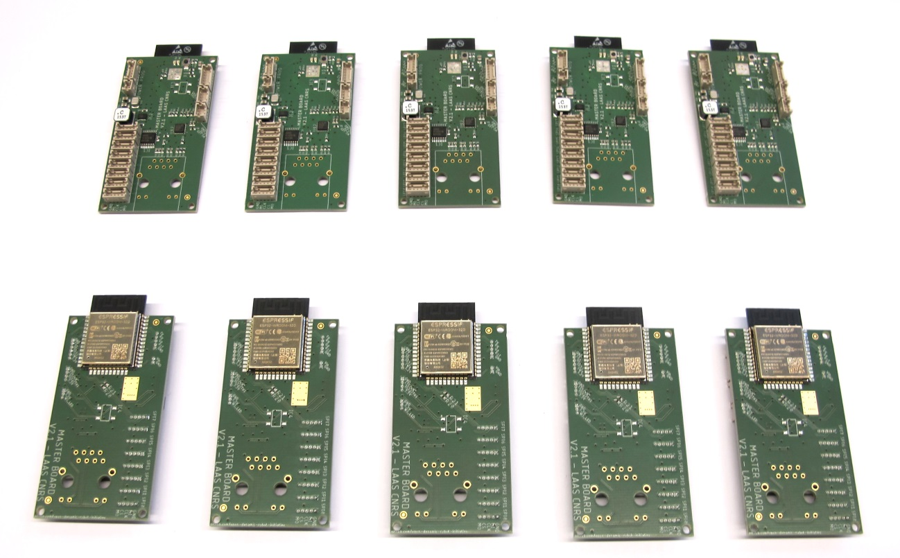
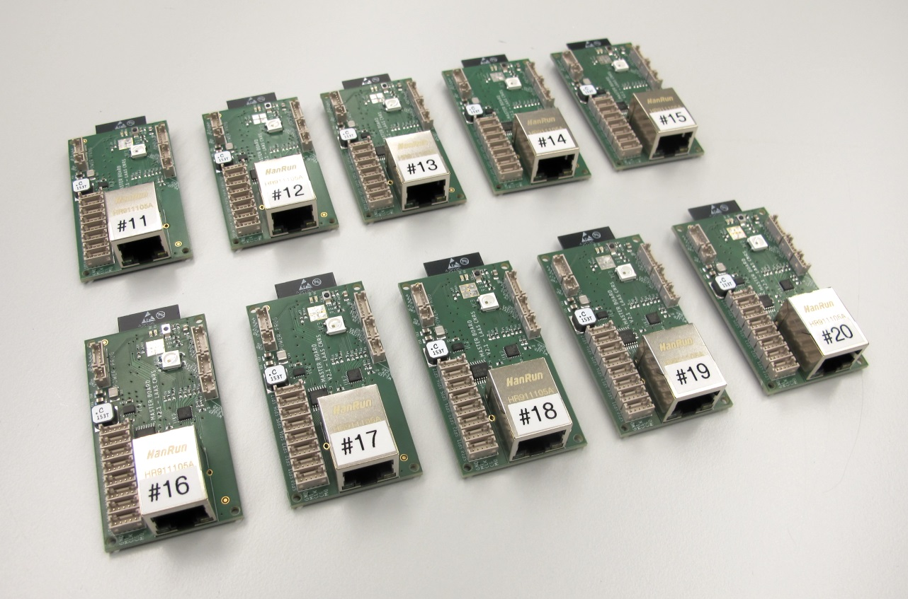
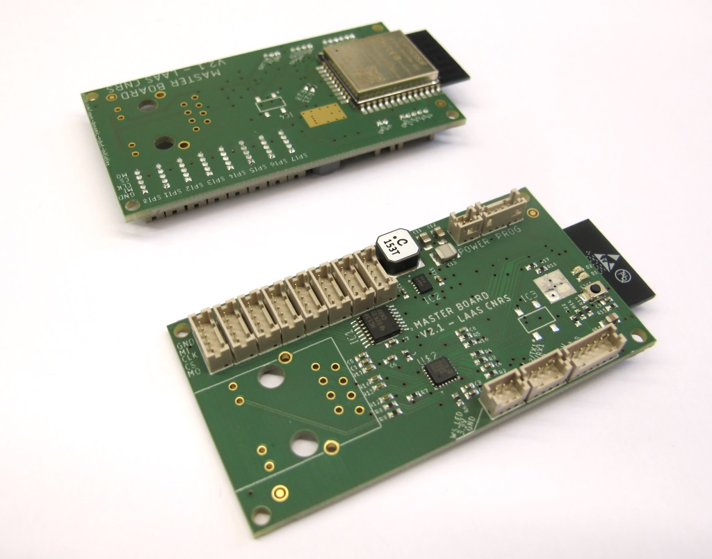
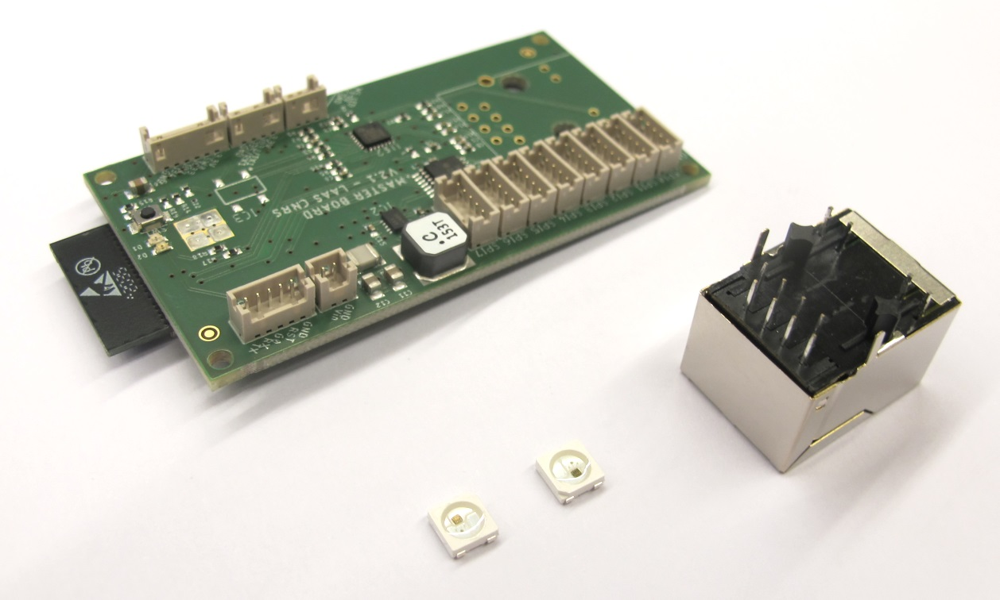
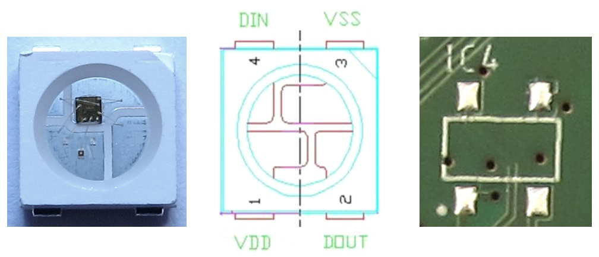
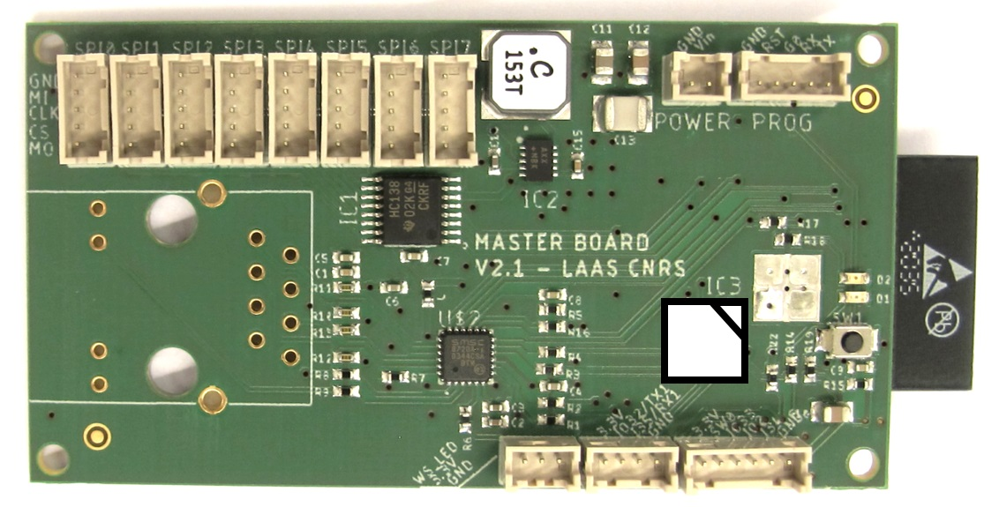
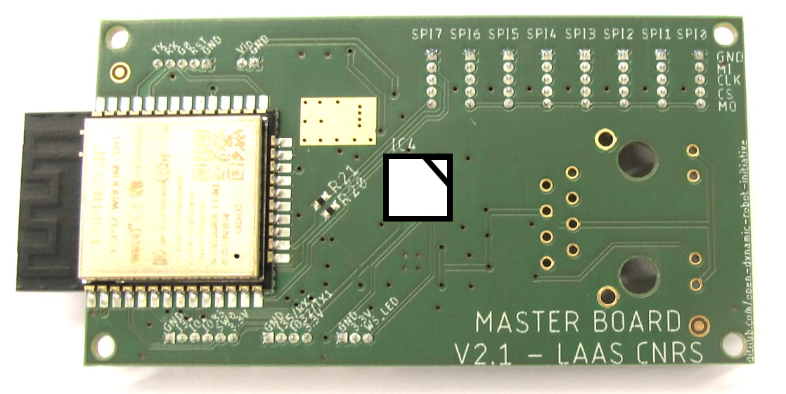
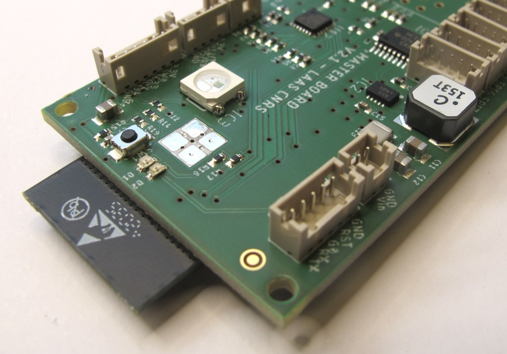
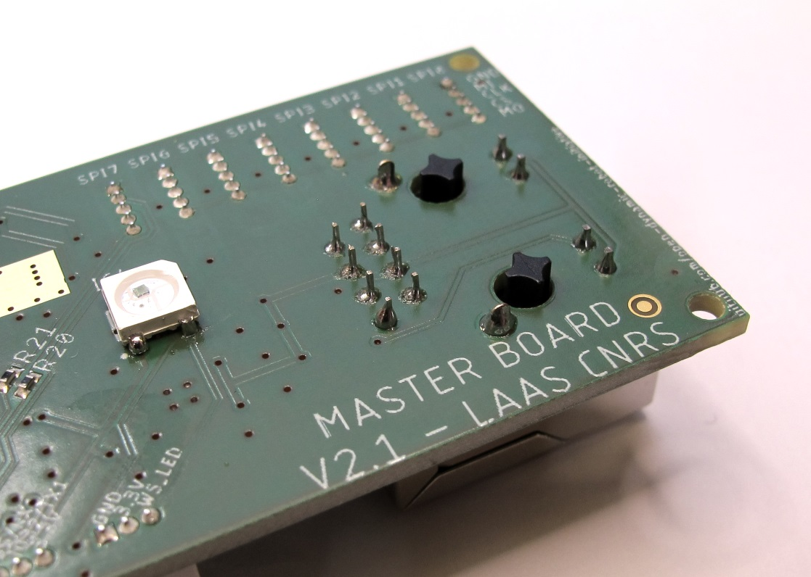
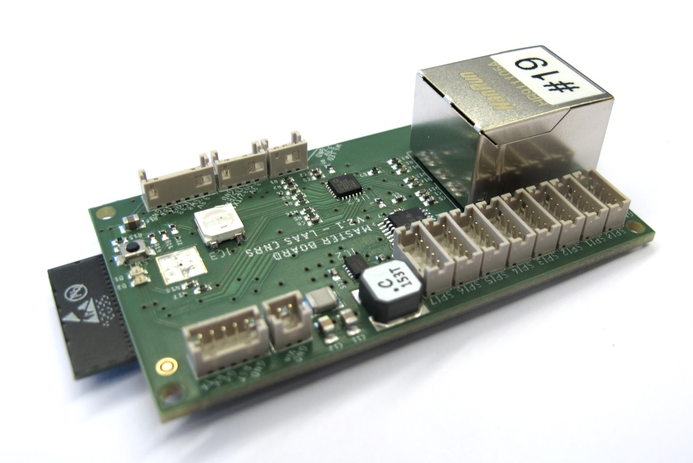

# Master Board Ordering and Preparation
 

## Description
* Master Board v2
* communicates with up to 8 MicroDriver Boards via SPI
* controls up to 16 brushless motors at 1kHz
* collects the IMU data at 1kHz
* ethernet or wifi communication with control pc at 1kHz
* dimensions: 65mm x 35mm
* mounting holes: ø 2,1 / spacing 61mm x 31mm
* 2 layer board / FR4 1,6mm / copper thickness 35μm
* 2 x RGB NeoPixel status leds
* supply voltage: 5V - 30V
* weight: 19g

## Ordering Instructions
 *Master Boards as delivered by BetaLayout.* 

We have been ordering the Master Boards from [BetaLayout](https://us.beta-layout.com/pcb/).
Beta Layout has the permission to replicate our MasterBoard v2 order for anybody who is interested - they ship worldwide.

Send an email to info.de@beta-layout.com and ask for a quote for replicating the Master Board v2 order according to the quote number **AN5eea24ae72697**. Specify the desired quantity and your location.

BetaLayout will send you a quote for producing the boards and for the placing and soldering service *- NOT including the cost of the electronic components.*

After you have placed the order for the boards Beta Layout will search for the components and will send you the component list with the actual component prices for your approval. For our last orders the component price was around 35€ per board.

We order the boards with all the components placed and soldered - except for the Ethernet jack and the NeoPixel leds. The soldering of those components is described [below](#preparing-the-master-board). The NeoPixel leds are very useful for visual status feedback but are not required to operate the Master Board.

 *Fully prepared Master Boards.* 

## Required Components
|Description|Details|Ordering Information|Comments|
|---|---|---|---|
|MasterBoard v2|esp32_master_board.brd|[BetaLayout](https://us.beta-layout.com/pcb/)|[Ordering Instructions](#ordering-instructions)|
|Ethernet Jack|HanRun RJ45 HR911105A|[CSD Electronics](https://csd-electronics.de/Mechanical-Comp-/Connectors/Modular/Network/HanRun-RJ45-jack-HR911105A-2xLED::12367.html?MODsid=foornd5v6nnu0bs9n58bvpqck1)|CSD Electronics ships worldwide.|
|Neo Pixel Led|WS2818B LED SMD 5050 with WS2811 controller|[Amazon](https://www.amazon.de/-/en/Set-100-LED-5050-Ws2811-WS2812B-Controller/dp/B00KFOLQ5O/ref=sr_1_5?dchild=1&keywords=100+stück+led+rgb+smd+5050&qid=1611738540&sr=8-5)||

## Preparing the Master Board
 *Master Boards as delivered.* 

 *Master Board, HanRun ethernet jack and NeoPixel leds.* 

 *The NeoPixel package is unsusual and misleading. The cut-off corner marks pin 3 instead of pin 1 as you might expect. Pin 1 is marked with a dot on the Master Board.  Make sure that the cut-off corner is opposite of the dot as shown below.* 

 *NeoPixel led orientation - top side.* 

 *NeoPixel led orientation - bottom side.* 

 *Solder the NeoPixel led to the top side of the board.* 

 *Solder the second NeoPixel led to the bottom side of the board.* 

 *Place the HanRun Ethernet Jack on the board. Solder and shorten the pins.* 

 *The Master Board is now ready to be flashed and used.* 

---
## More Information
[Open Dynamic Robot Initiative - Webpage](https://open-dynamic-robot-initiative.github.io) 
[Open Dynamic Robot Initiative - YouTube Channel](https://www.youtube.com/channel/UCx32JW2oIrax47Gjq8zNI-w) 
[Open Dynamic Robot Initiative - Forum](https://odri.discourse.group/categories) 
[Open Dynamic Robot Initiative - Paper](https://arxiv.org/pdf/1910.00093.pdf) 
[Hardware Overview](https://github.com/open-dynamic-robot-initiative/open_robot_actuator_hardware#open-robot-actuator-hardware) 
[Software Overview](https://github.com/open-dynamic-robot-initiative/open-dynamic-robot-initiative.github.io/wiki) 

## Authors
Thomas Flayols 
Felix Grimminger

## License
BSD 3-Clause License

## Copyright
Copyright (c) 2019-2021, LAAS-CNRS, Max Planck Gesellschaft and New York University
