# Master Board State Machine

The master board runs a state machine that handles the differents stages of communication and errors that can occur.

State machine description and behaviour
---
[](https://mermaid-js.github.io/mermaid-live-editor/#/edit/eyJjb2RlIjoic3RhdGVEaWFncmFtXG4gICAgc3RhdGUgXCJTRVRVUFwiIGFzIFNFVFVQOiBTZXR0aW5nIHVwIGFsbCBjb21wb25lbnRzXG4gICAgc3RhdGUgXCJXQUlUSU5HX0ZPUl9JTklUXCIgYXMgV0FJVElOR19GT1JfSU5JVDogV2FpdGluZyBmb3IgYW4gSW5pdCBwYWNrZXQgZnJvbSBQQ1xuICAgIHN0YXRlIFwiU1BJX0FVVE9ERVRFQ1RcIiBhcyBTUElfQVVUT0RFVEVDVDogRGV0ZWN0aW5nIGNvbm5lY3RlZCBTUEkgc2xhdmVzXG4gICAgc3RhdGUgXCJTRU5ESU5HX0lOSVRfQUNLXCIgYXMgU0VORElOR19JTklUX0FDSzogU2VuZGluZyBBY2tub3dsZWRnZW1lbnQgcGFja2V0IHRvIFBDXG4gICAgc3RhdGUgXCJBQ1RJVkVfQ09OVFJPTFwiIGFzIEFDVElWRV9DT05UUk9MOiBSb2JvdCBhY3RpdmVseSBjb250cm9sbGVkIGJ5IHRoZSBQQ1xuICAgIHN0YXRlIFwiV0lGSV9FVEhfTElOS19ET1dOXCIgYXMgV0lGSV9FVEhfTElOS19ET1dOOiBFdGhlcm5ldCBsaW5rIGlzIGRvd25cbiAgICBzdGF0ZSBcIldJRklfRVRIX0VSUk9SXCIgYXMgV0lGSV9FVEhfRVJST1I6IFRpbWVvdXQsIG5vIHBhY2tldCBmcm9tIFBDXG5cbiAgICBbKl0gLS0-IFNFVFVQXG4gICAgU0VUVVAgLS0-IFdBSVRJTkdfRk9SX0lOSVQ6IFNldHVwIGRvbmUgaW4gV2lGaVxuICAgIFxuICAgIFdJRklfRVRIX0xJTktfRE9XTiAtLT4gV0lGSV9FVEhfRVJST1I6IEV0aGVybmV0IExpbmsgVXBcblxuICAgIFdBSVRJTkdfRk9SX0lOSVQgLS0-IFNQSV9BVVRPREVURUNUOiBJbml0IHBhY2tldCByZWNlaXZlZFxuICAgIFxuICAgIFNQSV9BVVRPREVURUNUIC0tPiBTRU5ESU5HX0lOSVRfQUNLOiBOdW1iZXIgb2YgdGVzdCB0cmFuc2FjdGlvbnMgZXhjZWVkZWRcblxuICAgIFNFTkRJTkdfSU5JVF9BQ0sgLS0-IFdJRklfRVRIX0VSUk9SOiBUaW1lb3V0IGFja25vd2xlZGdlbWVudFxuICAgIFNFTkRJTkdfSU5JVF9BQ0sgLS0-IEFDVElWRV9DT05UUk9MOiBGaXJzdCBjb21tYW5kIHBhY2tldCByZWNlaXZlZFxuXG4gICAgQUNUSVZFX0NPTlRST0wgLS0-IFdJRklfRVRIX0VSUk9SOiBUaW1lb3V0IGNvbnRyb2xcblxuICAgIFdJRklfRVRIX0VSUk9SIC0tPiBTUElfQVVUT0RFVEVDVDogSW5pdCBwYWNrZXQgcmVjZWl2ZWRcbiIsIm1lcm1haWQiOnsidGhlbWUiOiJkZWZhdWx0In19)

Diagram generated using [Mermaid](https://github.com/mermaid-js/mermaid) Live Editor, click on picture to edit.

During **WAITING_FOR_INIT**, the master board waits for an init message from both ethernet and wifi, checking all channels. This enables an autoselection of the type of communication with the computer.

Please note that **WIFI_ETH_LINK_DOWN** state is accessible from any state except WAITING_FOR_INIT via a callback on the ethernet link down event, but links have not been drawn for the sake of readability.

State machine LED code
---
To each state is associated a LED behaviour.

State | LED behaviour
--- | ---
SETUP | Steady White
WAITING_FOR_INIT | Red Fade
SPI_AUTODETECT | Magenta Fade
SENDING_INIT_ACK | Blue Fade
ACTIVE_CONTROL | Green Fade
WIFI_ETH_LINK_DOWN | Yellow Blink
WIFI_ETH_ETH_ERROR | Red Blink
