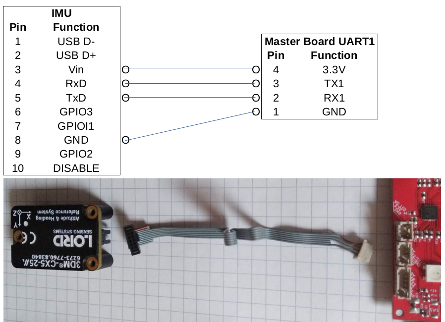

# Master Board Wiring

This page discribe the different connectors on the masterboard and how to inferface with sensors and actuators.

Power
----
DC Power is provided to the masted board via the two pins POWER connector.
Absolute maximum voltage is 60V. 
Because of the size of the connector, without more insulation the voltage shoud be lower (30V).
Minimum voltage is 4.5V.

Programator
----
The baord is programed via a 3.3V serial connection on the 5pins PROG connector. When flashing, the board needs to be powered.
See how to flash the board here: (todo link)

SPI
----
The MB can connect to slaves SPI on one of the 8 x 5pins SPIx connectors.

IMU
----
3dm-cx5-2 IMU can be connected to the MB on the 4pins UART1 Connector.

https://www.microstrain.com/inertial/3dm-cx5-25 

Cable reference: https://www.digikey.fr/product-detail/fr/samtec-inc/FFSD-05-S-06-00-01-N/SAM8221-ND/1106580

It's also possible to buy the connector and ribbon cable separetly to have custom length

NeoPixels
----
Daisy chained RGB LED compatible with neopixel can be plug on the 3pins LED connector

General IO
----

Ethernet
----

