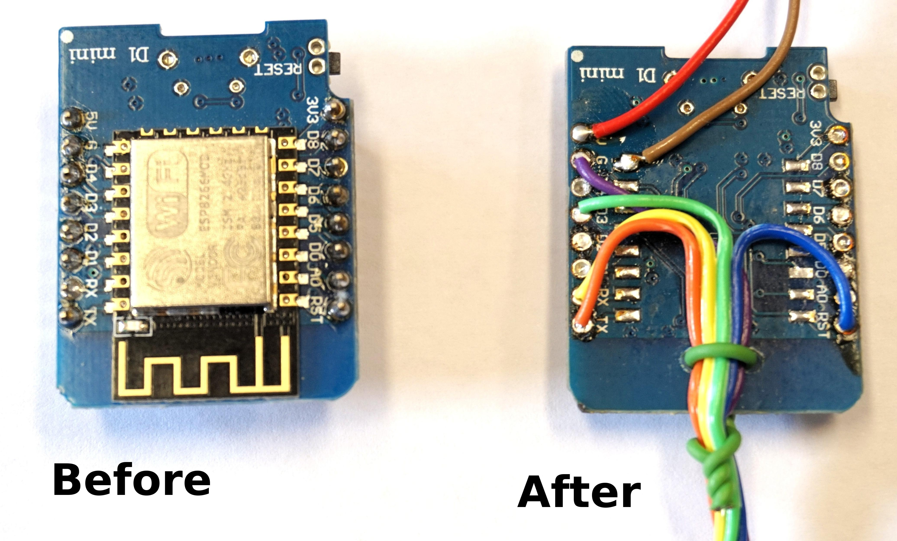
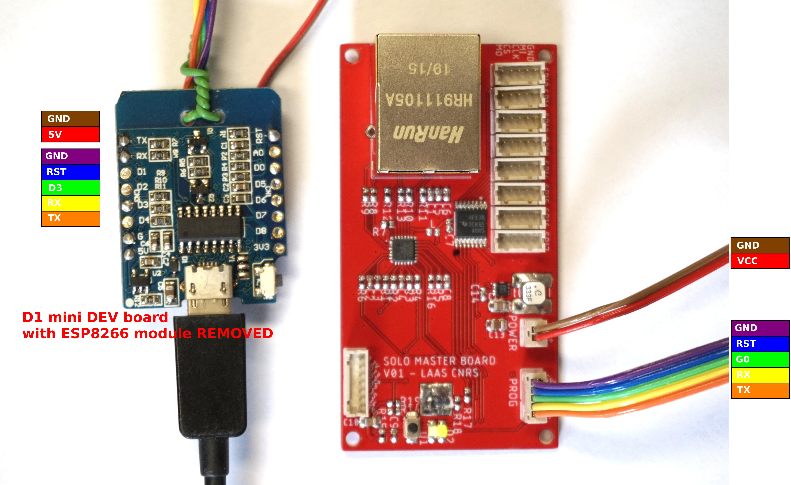

# How to flash the Master Board

Install esp-idf
--------
The master board is based on a ESP32 module programmed in C++ using the expressif idf SDK https://github.com/espressif/esp-idf

To install the SDK (v4.0.1) simply follow the instruction form https://docs.espressif.com/projects/esp-idf/en/v4.0.1/get-started/index.html.

Firmware of the ESP32 can be found here https://github.com/open-dynamic-robot-initiative/master-board.

You will also need to install the `esptool` from here https://github.com/espressif/esptool.

To flash the firmware without admin rights, make sure your local user is part of the `dialout` group. You can check the groups of your current user using the `groups` command and add the user to the dialout group using the command `usermod -a -G dialout $USER`

Flashing the firmware
--------

The Master Board need to be connected to a host computer via the PROG connector, and to be powered from a DC source from 5V to 60V. The programmer is a simple USB to SERIAL adapter with line RTS and DTR accessible.

To put the ESP32 in a flash mode, a special circuit is needed to lower the G0 pin from the RTS and DTR lines and generate a reset. To avoid using a dedicated hardware, we can use an ESP dev board containing this circuit and the USB to SERIAL adapter, where the orginal ESP module have been removed:

On a freshly assembled board, we first need to burn a configuration fuse  because of a conflict with a boot pin. To do so, use the [espefuse.py script](https://github.com/espressif/esptool): (the fuse burning process is irreversible, be sure to only execute the following command)

`python espefuse.py set_flash_voltage 3.3V`

To flash the board, from the `master-board/firmware` folder, you can run:

* Flash the board: `make flash`
* Change configurations: `make menuconfig`
* Debug the board: `make monitor`
